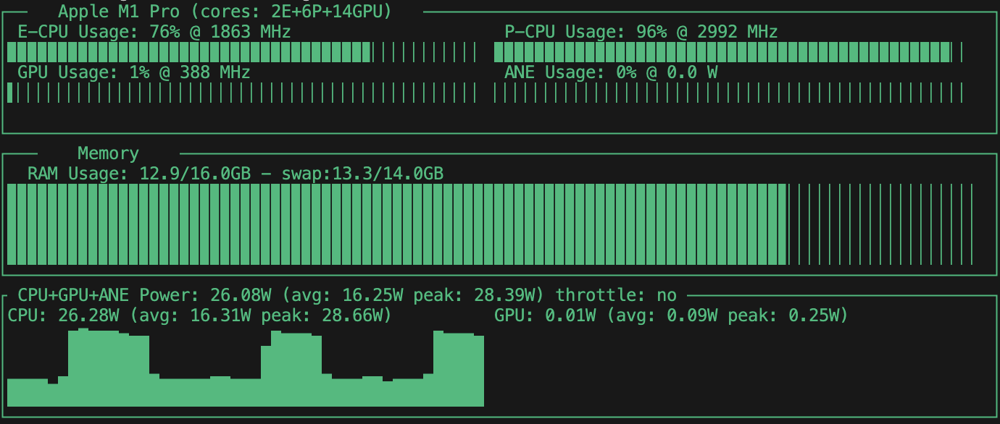
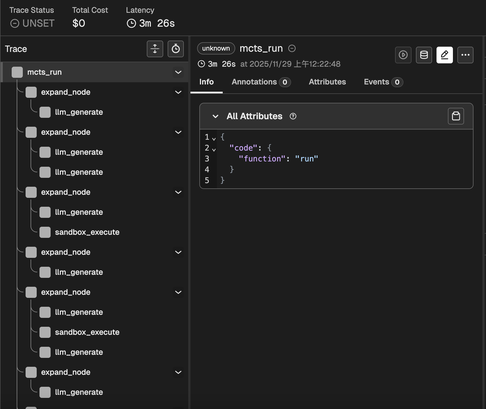
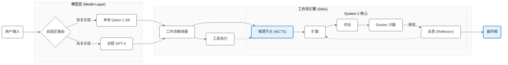

<div align="center">

# Reason-Code: On-Device System 2 Reasoning Platform 🤖

[](https://www.python.org/downloads/)
[](https://opensource.org/licenses/MIT)
[](https://www.docker.com/)
[](https://github.com/psf/black)

<br/>


<br/>

**Scaling Inference-time Compute for Code Generation on Edge Devices**

[**English**](#-english) | [**中文**](#-chinese)

---
</div>

<a id="-english"></a>

## 📖 Abstract

Reason-Code is an experimental AI Agent platform designed to verify the Inference-time Scaling Laws on consumer-grade hardware. It transforms small-scale local LLMs (specifically Qwen-2.5-1.5B) into powerful reasoning engines by implementing System 2 thinking methodologies:Monte Carlo Tree Search (MCTS) for solution space exploration.Execution-based Reflexion for iterative self-correction.Unlike standard "System 1" generation (Greedy/Temperature sampling), Reason-Code treats code generation as a multi-step reasoning workflow. It features a Hybrid Model Router and a DAG-based Workflow Engine, explicitly optimized for Apple Silicon (M1/M2) architectures, achieving significant performance gains on complex benchmarks where baseline models fail.

## 🏗️ System Architecture (v2.0)

The system is built on a modular Agentic Framework comprising three core subsystems:Hybrid Model Router: Dynamically routes tasks based on complexity. Simple tasks run locally on Qwen-1.5B (LoRA) for privacy and speed, while complex tasks can be routed to remote SOTA APIs (e.g., GPT-4).DAG Workflow Engine: A flexible orchestration engine that manages Tools, Reasoning Nodes, and Execution Sandboxes in a directed acyclic graph.Secure Sandbox: An ephemeral Docker-based environment that executes generated code, captures stderr, and provides feedback for the Reflexion module.
Workflow Diagram

```mermaid
%%{init: {'theme': 'base', 'themeVariables': { 'primaryColor': '#E3F2FD', 'edgeLabelBackground':'#ffffff', 'tertiaryColor': '#fff', 'clusterBkg': '#fafafa', 'clusterBorder': '#e0e0e0', 'lineColor': '#555'}}}%%
graph LR
    classDef default fill:#fff,stroke:#333,stroke-width:1px,rx:5,ry:5;
    classDef highlight fill:#E3F2FD,stroke:#1565C0,stroke-width:2px;

    User("User Query") --> Router{"Adaptive Router"}
    
    subgraph ModelLayer ["Model Layer"]
        direction TB
        Router -- "Simple" --> Local["Local Qwen-1.5B"]
        Router -- "Complex" --> Remote["Remote GPT-4"]
    end
    
    Local & Remote --> Orchestrator
    
    subgraph Workflow ["Workflow Engine (DAG)"]
        direction LR
        Orchestrator["Orchestrator"] --> ToolNode["Tool Execution"]
        Orchestrator --> ReasonNode["Reasoning (MCTS)"]:::highlight
        
        ToolNode -.-> ReasonNode
        
        subgraph Core ["System 2 Core"]
            direction TB
            ReasonNode --> Expansion["Expansion"]
            Expansion --> Evaluation["Evaluation"]
            Evaluation --> Sandbox["Docker Sandbox"]
            Sandbox -- "Stderr" --> Reflexion["Reflexion"]
            Reflexion -.-> Expansion
        end
    end
    
    Reflexion --> Output("Final Solution"):::highlight
```


## 📂 Project Structure

A domain-driven design structure ensuring scalability and maintainability:
```Plaintext
src/reason_code/
├── agent/                  # Core Reasoning Algorithms (MCTS, Reflexion)
├── workflow/               # Async DAG Execution Engine
├── models/                 # Model Adapter Layer (Router, LoRA, OpenAI)
├── executor/               # Docker Sandbox Manager
├── tools/                  # Plugin System (@registry.register)
└── utils/                  # Observability (OpenTelemetry, Logger)
```

## 📊 Performance & Experiments:

We evaluated the system on the HumanEval benchmark (Hard Subset: Tasks 90-110), specifically selecting problems that require multi-step logical reasoning.

**Hardware**: MacBook Pro (M1 Pro, 16GB RAM) **Model**: Qwen-2.5-Coder-1.5B-Instruct (LoRA Fine-tuned)

1. Benchmark Results

| Method | Search Strategy | Syntax Pass Rate | Logic Pass Rate (Pass@1) | Avg Latency |
| :--- | :--- | :---: | :---: | :---: | 
| Baseline | Zero-shot Greedy (n=1) | 100% | 40.0% (8/20) | 29.2s |
| Reason-Code | MCTS Search (n=10) | 100% | 50.0% (10/20) | 283.3s |

**Analysis**: In the challenging task range (HumanEval 90-110), Reason-Code achieved a **+25% relative improvement** (from 40% to 50%) in logical correctness.

**Note on Latency**: The increase in latency (283s vs 29s) reflects the deliberate **Inference-time** Compute trade-off. This time includes 10 full MCTS simulation paths, Docker container spin-up/tear-down cycles, and the Reflexion loops. We trade time for intelligence.

## 2. Edge-Native Optimization

The system maximizes hardware utilization on Apple Silicon. The screenshot below demonstrates **96% P-CPU utilization** and **30W power consumption** during parallel MCTS simulations, proving efficient asyncio thread pool management without OOM (Out of Memory).

<div align="center">  </div>

## 3. Observability (Trace View)

Integrated with **Arize Phoenix** for full trace visualization. The trace below shows the agent autonomously fixing a syntax error via the MCTS expansion and Reflexion loop. Note the tree structure expanding on the left side.

<div align="center">  </div>

## 🛠️ Quick Start
### Prerequisites
* Python 3.10+
* Docker Desktop (Must be running for Sandbox execution)

## Installation
```Bash
git clone [https://github.com/Liz915/reason-code.git](https://github.com/Liz915/reason-code.git)
cd reason-code
pip install -r requirements.txt
```
### Usage
## 1. Run the Agent Workflow (Search + Code)
```Bash
python examples/demo_workflow.py
```
## 2. Run Benchmarks
```Bash
python benchmarks/humaneval_test.py
```
### 📚 References
* **DeepSeek-Coder-V2**: *Breaking the Barrier of Closed-Source Models in Code Intelligence* ([Paper](https://arxiv.org/abs/2406.11931))
* **AlphaCode**: *Competition-Level Code Generation with AlphaCode* ([Paper](https://arxiv.org/abs/2203.07814))
* **Reflexion**: *Language Agents with Verbal Reinforcement Learning* ([Paper](https://arxiv.org/abs/2303.11366))
* **Qwen2.5**: *Qwen2.5 Technical Report* ([Paper](https://qwenlm.github.io/blog/qwen2.5/))

### 📄 License

MIT License © 2025 Zixu Li

---
<a id="-chinese"></a>

<div align="center">

# 🤖 Reason-Code: 端侧 System 2 代码推理平台

**探索端侧设备上的推理时计算 (Inference-time Compute) 与 Agent 架构**

<br/>

[English](#-english) | [中文](#-chinese)

</div>

### 📖 项目背景

**Reason-Code**是一个模块化的 AI Agent 平台。它致力于验证 **"推理时计算 (Inference-time Scaling)"** 的假设。通过集成 **MCTS（蒙特卡洛树搜索** 和 **Docker 执行反馈 (Reflexion)**，本项目成功让仅有 1.5B 参数的小模型在资源受限的端侧设备（如 MacBook M1）上展现出 System 2 级别的逻辑推理能力。

### 🌟 核心能力 (v2.0)
* **⚙️ DAG 工作流引擎**: 支持将工具调用、推理节点和沙箱执行串联成灵活的有向无环图流水线。
* **🔀 智能模型路由**: 根据任务复杂度动态切换本地小模型（降本/隐私）和云端大模型（增效）。
* **🧩 插件系统**: 基于装饰器的插件注册机制，支持搜索、计算器等外部工具扩展。
* **🛡️ 安全沙箱**: 所有代码均在资源受限的 Docker 容器中执行，确保宿主机安全。

### 🏗️ 核心架构 (v2.0)

### 📊 性能与可观测性

## 1、实验数据

我们在 HumanEval 难题区间（Task 90-110）上进行了严格的对比实验
| 方法 | 策略描述 | 语法通过率 | 逻辑通过率 (Pass@1) | 平均耗时 (Avg Latency) |
| :--- | :--- | :---: | :---: | :---: |
| Baseline | Zero-shot Greedy ($n=1$) | 100% | 40.0% (8/20) | 29.23s |
| Reason-Code | MCTS 搜索 ($n=10$) | 100% | 50.0% (10/20) | 283.34s |

**结论**: 通过引入 System 2 推理，Reason-Code 实现了 **25% 的相对性能提升**。

**关于耗时**: 平均耗时从 29s 增加到 283s，这是为了换取更高智能所付出的计算成本（Inference-time Compute）。这包含 10 次完整的模拟路径、Docker 容器的反复启动与销毁以及反思修正的过程。资源监控

## 2. 端侧极限优化 (Edge-Native Optimization)
针对 Apple Silicon 统一内存架构深度优化。下图展示了在 10 并发 MCTS 搜索下的硬件负载：P-CPU 利用率高达 96%，功耗稳定在 26W+，证明了 asyncio 线程池的高效调度。

<div align="center">  </div>

## 3. 全链路可观测性 (Observability)

集成 Arize Phoenix 可视化 Agent 的思考过程。下图展示了系统如何通过 MCTS 树扩展（左侧树状图），利用沙箱报错信息自动修复代码 bug。

<div align="center">  </div>

### 🛠️ 快速开始
## 1. 安装依赖
```Bash
git clone [https://github.com/Liz915/reason-code.git](https://github.com/Liz915/reason-code.git)
cd reason-code
pip install -r requirements.txt
```
## 2. 运行完整工作流演示
```Bash
python examples/demo_workflow.py
```
## 3. 运行基准测试
```Bash
python benchmarks/humaneval_test.py
```
## 📚 参考文献与致谢

本项目在实现过程中参考了以下代码生成与推理领域的经典论文，特此致谢：

* **DeepSeek-Coder-V2**: *Breaking the Barrier of Closed-Source Models in Code Intelligence* ([论文链接](https://arxiv.org/abs/2406.11931))
    * *参考点：MCTS 在代码生成中的应用与模型能力的评估标准。*
* **AlphaCode**: *Competition-Level Code Generation with AlphaCode* ([论文链接](https://arxiv.org/abs/2203.07814))
    * *参考点：大规模采样与过滤策略 (Generate & Filter)。*
* **Reflexion**: *Language Agents with Verbal Reinforcement Learning* ([论文链接](https://arxiv.org/abs/2303.11366))
    * *参考点：基于执行反馈的自我反思与修正机制。*
* **Qwen2.5**: *Qwen2.5 Technical Report* ([官方报告](https://qwenlm.github.io/blog/qwen2.5/))
    * *参考点：作为本项目的基础策略网络 (Policy Network)。*


## 📄 许可证

MIT License © 2025 Zixu Li


